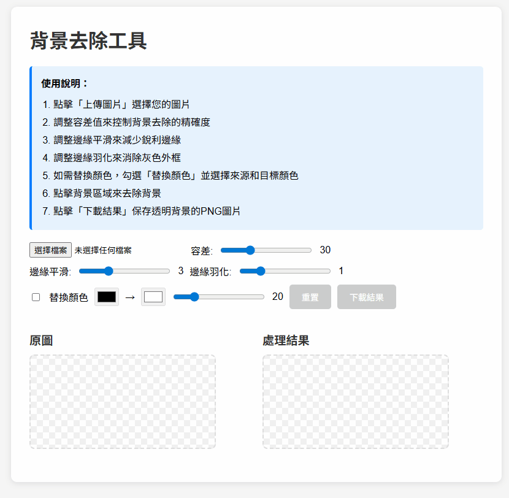

# 🎨 背景去除工具 (Background Removal Tool)

一個強大且易用的基於瀏覽器的背景去除工具，使用純 JavaScript 實現，無需服務器端處理。


## ✨ 功能特點

- 🖼️ **智能背景去除**：使用洪水填充算法精確識別和移除背景
- 🎯 **可調整容差**：支持自定義顏色匹配容差，適應各種背景
- ✂️ **邊緣平滑**：多次迭代平滑處理，消除鋸齒邊緣
- 🌫️ **邊緣羽化**：柔化邊緣過渡，獲得更自然的效果
- 🎨 **顏色替換**：支持將圖像中的特定顏色替換為其他顏色
- 📱 **響應式設計**：完美適配桌面、平板和手機設備
- 💾 **本地處理**：所有處理在瀏覽器本地完成，保護隱私
- 📥 **PNG 導出**：支持導出帶透明背景的 PNG 圖像

## 🚀 開始使用

### 在線使用

直接在瀏覽器中打開 `index.html` 文件即可使用，無需安裝任何依賴。



### 本地部署

1. **克隆倉庫**

```bash
git clone https://github.com/your-username/background-remover.git
cd background-remover
```

2. **啟動本地服務器**

由於使用了 ES6 模塊，需要通過 HTTP 服務器訪問。您可以使用以下任一方法：

**使用 Python 3：**

```bash
python -m http.server 8000
```

**使用 Node.js (http-server)：**

```bash
npx http-server -p 8000
```

**使用 VS Code：**

- 安裝 "Live Server" 擴展
- 右鍵點擊 `index.html` 並選擇 "Open with Live Server"

3. **訪問應用**

在瀏覽器中打開 `http://localhost:8000`

## 📖 使用說明

### 基本操作

1. **上傳圖片**點擊「上傳圖片」按鈕，選擇您要處理的圖片文件
2. **調整參數**
   - **容差**：控制顏色匹配的精確度（0-100）
   - **邊緣平滑**：減少銳利邊緣的迭代次數（0-10）
   - **邊緣羽化**：消除灰色外框的程度（0-5）

3. **移除背景**在左側原圖上點擊要移除的背景區域
4. **顏色替換（可選）**
   - 勾選「替換顏色」複選框
   - 選擇來源顏色和目標顏色
   - 調整顏色容差

5. **保存結果**
   點擊「下載結果」按鈕保存透明背景的 PNG 圖片

### 最佳實踐

- ✅ **簡單背景**：對於純色或接近純色的背景效果最佳
- ✅ **高對比度**：前景與背景顏色對比越大，效果越好
- ✅ **調整容差**：如果背景未完全移除，嘗試增加容差值
- ✅ **邊緣處理**：使用邊緣平滑和羽化功能獲得更自然的效果

## 🏗️ 項目結構

```
background-remover/
├── index.html              # 主 HTML 文件
├── css/
│   └── styles.css          # 樣式表
├── js/
│   ├── app.js              # 主應用入口
│   ├── core/
│   │   ├── BackgroundRemover.js   # 背景去除核心邏輯
│   │   └── ImageProcessor.js      # 圖像處理類
│   └── utils/
│       └── ColorUtils.js   # 顏色工具函數
├── README.md               # 項目文檔
├── LICENSE                 # 授權文件
└── .gitignore              # Git 忽略文件
```

## 🛠️ 技術架構

### 核心技術

- **HTML5 Canvas API**：用於圖像渲染和像素操作
- **ES6+ JavaScript**：使用現代 JavaScript 特性
- **CSS3**：響應式佈局和現代化樣式
- **模塊化設計**：遵循 SOLID 原則的類結構

### 算法原理

#### 1. 洪水填充算法 (Flood Fill)

```
從點擊位置開始，遞歸或迭代地擴展到相鄰的相似顏色像素
使用堆疊結構避免遞歸深度限制
```

#### 2. 顏色距離計算

```
採用感知加權歐氏距離：
distance = √(ΔR² × 0.3 + ΔG² × 0.59 + ΔB² × 0.11)

權重基於人眼對不同顏色通道的敏感度
```

#### 3. 邊緣平滑

```
使用 3×3 平均濾波器多次迭代
減少邊緣鋸齒並平滑過渡
```

#### 4. 邊緣羽化

```
計算每個像素到遮罩邊緣的距離
根據距離動態調整 Alpha 通道值
```

## 🎯 設計原則

本項目嚴格遵循以下設計原則：

### SOLID 原則

- **S - 單一職責原則 (Single Responsibility)**每個類負責單一功能：`ColorUtils`（顏色處理）、`ImageProcessor`（圖像操作）、`BackgroundRemover`（背景去除）
- **O - 開閉原則 (Open/Closed)**類對擴展開放，對修改關閉，易於添加新功能
- **L - 里氏替換原則 (Liskov Substitution)**所有類都可以被其子類替換而不影響程序正確性
- **I - 接口隔離原則 (Interface Segregation)**每個類只暴露必要的公共方法
- **D - 依賴反轉原則 (Dependency Inversion)**
  高層模塊不依賴低層模塊，都依賴於抽象

### 其他原則

- **DRY (Don't Repeat Yourself)**：避免代碼重複
- **KISS (Keep It Simple, Stupid)**：保持代碼簡單直觀
- **YAGNI (You Aren't Gonna Need It)**：不實現不需要的功能

## 🔒 安全性

- ✅ 遵循 OWASP 最佳實踐
- ✅ 所有處理在客戶端完成，無數據上傳
- ✅ 無外部依賴，減少供應鏈風險
- ✅ 輸入驗證和錯誤處理

## 🌐 瀏覽器兼容性

| 瀏覽器  | 最低版本 |
| ------- | -------- |
| Chrome  | 60+      |
| Firefox | 60+      |
| Safari  | 12+      |
| Edge    | 79+      |
| Opera   | 47+      |

## 📝 開發指南

### 代碼風格

- 使用 ES6+ 語法
- 遵循 JavaScript Standard Style
- 類名使用 PascalCase
- 方法名使用 camelCase
- 私有方法使用 JSDoc 標記 `@private`

### 添加新功能

1. 在適當的類中添加方法
2. 添加完整的 JSDoc 註解
3. 更新 README.md 文檔
4. 測試兼容性

### 代碼註解規範

```javascript
/**
 * 方法描述
 * @description 詳細說明（可選）
 * @param {type} name - 參數說明
 * @returns {type} 返回值說明
 * @example
 * exampleCode()
 */
```

## 🤝 貢獻指南

歡迎貢獻！請遵循以下步驟：

1. Fork 本倉庫
2. 創建特性分支 (`git checkout -b feature/AmazingFeature`)
3. 提交更改 (`git commit -m 'Add some AmazingFeature'`)
4. 推送到分支 (`git push origin feature/AmazingFeature`)
5. 開啟 Pull Request

## 📄 授權協議

本項目採用 MIT 授權協議 - 詳見 [LICENSE](LICENSE) 文件

## 👥 作者

**Jony-Zhou**

## 📮 聯繫方式

- 問題反饋：[GitHub Issues](https://github.com/your-username/background-remover/issues)
- 功能建議：[GitHub Discussions](https://github.com/your-username/background-remover/discussions)

## 🗺️ 路線圖

- [ ] 添加更多圖像編輯功能
- [ ] 支持更多導出格式
- [ ] 國際化支持

---

**如果這個項目對您有幫助，請給一個 ⭐ Star！**
